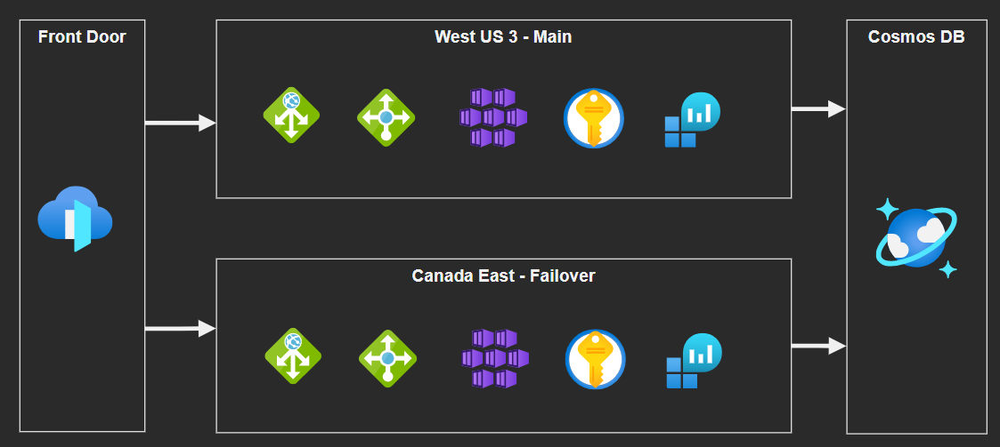

# Azure Multi-Region AKS Cluster

A multi-region AKS cluster configured with Terraform.



## Cloud Deployment

### 1 - Enable OIDC Issuer

Enable [OIDC Preview](https://docs.microsoft.com/en-us/azure/aks/cluster-configuration#oidc-issuer-preview) as part of Managed Identity configuration. Follow the documentation and once finished, return here to create to continue.

### 2 - Network Deployment

These are the base components to b

```sh
# Create Azure resources
terraform -chdir='infrastructure/network' init
terraform -chdir='infrastructure/network' apply -auto-approve
```

You can now connect to the JumpBox VM using Bastion, and securely access the Kubernetes network.

### 3 - Connect to Azure Bastion

The jumpbox machine will be initiated with a `cloud-init` script to install Terraform, Azure CLI and Kubectl automatically.

Use Bastion to connect to the Virtual Machine and clone /download the source code again.

### 4 - Workload Infrastructure

This will create all of the Azure resources: AKS, Cosmos, Ingress, Key Vault, Log Analytics, and many others.

```sh
terraform -chdir='infrastructure/azure' init
terraform -chdir='infrastructure/azure' apply -auto-approve
```

### 3 - Azure Resources Deployment

```sh
terraform -chdir='infrastructure/kubernetes' init
terraform -chdir='infrastructure/kubernetes' apply -auto-approve
```

Create the Kubernetes objects defined in `yaml` manifests:

```sh
# Connect to the cluster
group='<resource_group_name>'
aks='<ask_cluster_name>'

az aks get-credentials -g $group -n $aks

# Create the Deployments and Services
kubectl apply -f 'kubernetes'

# Deploy the rules to the Application Gateway
kubectl apply -f 'kubernetes/azure'
```

That's it! Services should be available using the Azure Front Door endpoint.

## Local Development

Start MongoDB

```sh
docker run -d --name mongodb -p 27017:27017 mongo
```

Working with the microservices (open each one individually on VS Code for a better experience):

```sh
# Creates venv in project
mkdir .venv

# Ad-hoc fix for https://github.com/pypa/setuptools/issues/3278
export SETUPTOOLS_USE_DISTUTILS=stdlib

# get the dependencies
pipenv install --dev
pipenv shell

# start
python3 -m flask run
```

Starting the frontend (under development):

```sh
yarn install
yarn dev -o
```

### Local development with Cloud resources

This will create the necessary resources to develop locally but with Azure resources instead of locals, which is useful to test before pushing for integration testing.

```sh
terraform -chdir='infrastructure/development' init
terraform -chdir='infrastructure/development' apply -auto-approve
```

Set the Key Vault URI to your `.env` file.

Authentication works via local context, so you must be connected with `az login`. Microsoft SDKs will automatically detect the authenticated context when connecting to the Key Vault.

### Minikube

```sh
minikube start
minikube addons enable ingress

kubectl apply -f kubernetes/minikube/mongo.yaml
kubectl apply -f kubernetes/kubernetes.yaml
kubectl apply -f kubernetes/minikube/nginx-ingress.yaml

minikube tunnel
```

### Docker

```
docker build --tag poll .
docker build --tag vote .

docker run -p 4000:8080 --name poll-app poll
docker run -p 5000:8080 --name vote-app vote
```

Or with Docker Compose:

```sh
docker-compose build
docker-compose up
```

## Source

```
https://pipenv-fork.readthedocs.io/en/latest/basics.html
https://sourcery.ai/blog/python-docker/
https://stackoverflow.com/questions/24238743/flask-decorator-to-verify-json-and-json-schema
https://docs.microsoft.com/en-us/azure/aks/concepts-network
https://docs.microsoft.com/en-us/azure/application-gateway/tutorial-ingress-controller-add-on-new
https://docs.microsoft.com/en-us/azure/application-gateway/ingress-controller-overview
https://docs.microsoft.com/en-us/azure/architecture/reference-architectures/containers/aks/secure-baseline-aks
https://azure.github.io/application-gateway-kubernetes-ingress/how-tos/networking/
https://github.com/Azure/AKS/releases/tag/2022-02-24
https://docs.microsoft.com/en-us/azure/aks/configure-kubenet
https://docs.microsoft.com/en-us/azure/azure-monitor/containers/container-insights-log-query
https://docs.microsoft.com/en-us/azure/application-gateway/ingress-controller-add-health-probes
http://pylint-messages.wikidot.com/all-messages
https://azure.github.io/azure-workload-identity/docs/
https://docs.microsoft.com/en-us/azure/developer/terraform/create-k8s-cluster-with-tf-and-aks
https://learn.hashicorp.com/tutorials/terraform/kubernetes-provider
https://docs.microsoft.com/en-us/azure/aks/configure-azure-cni
https://docs.microsoft.com/en-us/azure/aks/operator-best-practices-network
```