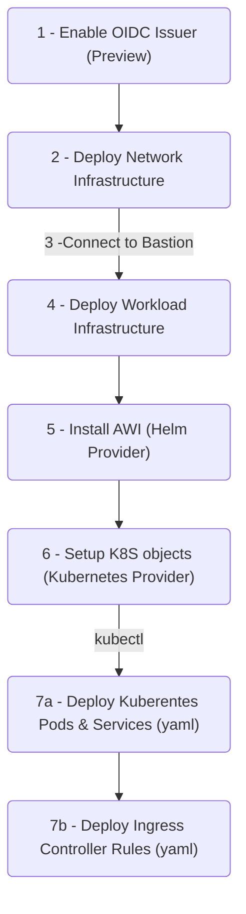

# Azure Multi-Region AKS Cluster

A multi-region AKS cluster managed using Terraform.

This is an implementation derived from [AKS Baseline for Multiregion AKS Clusters](https://docs.microsoft.com/en-us/azure/architecture/reference-architectures/containers/aks-multi-region/aks-multi-cluster).

## Solution Architecture

![Multi-region Solution][1]

### Workload Identity

This solution also implements Azure Workload Identity.

Enabling Pods to connect directly to the Key Vaults without exchanging the KV token ended up being it's own separate project.

You can check it in isolation in my repo [azure-workload-identity-terraform](https://github.com/epomatti/azure-workload-identity-terraform).

![Worload Identity][2]

## Cloud Deployment

Follow these steps to deploy the complete demonstration solution.



### 1 - Enable OIDC Issuer (Preview)

Enable [OIDC Preview](https://docs.microsoft.com/en-us/azure/aks/cluster-configuration#oidc-issuer-preview) as part of Managed Identity configuration. Follow the documentation and once finished, return here to create to continue.

### 2 - Network Deployment

These are the base components on which your workload will be deployed:

```sh
# Create Azure resources
terraform -chdir='infrastructure/network' init
terraform -chdir='infrastructure/network' apply -auto-approve
```

The AKS cluster, along with Key Vault and Cosmos, will be private.

You can now connect to the JumpBox VM using Bastion, and securely access the Kubernetes network.

### 3 - Connect to Azure Bastion

The jumpbox machine will be initiated with a `cloud-init` script to install Terraform, Azure CLI and Kubectl automatically. Use Bastion to connect to the Virtual Machine and clone /download the source code again.

You'll need to login to Azure again with `az login`.

### 4 - Workload Infrastructure

This will create all of the Azure resources: AKS, Cosmos, Ingress, Key Vault, Log Analytics, and many others.

```sh
terraform -chdir='infrastructure/azure' init
terraform -chdir='infrastructure/azure' apply -auto-approve
```

### 5 - Helm Setup + Workload Identity

This will deploy the Workload Identity components using a Helm provider.

```sh
terraform -chdir='infrastructure/helm' init
terraform -chdir='infrastructure/helm' apply -auto-approve
```

This step needs to be performed in the Main and Failover instances.

### 6 - Kubernetes Setup

Setup of the Kubernetes resources, such as Config and Secrets with connection strings that are derived from dynamic values generated by Azure.

```sh
terraform -chdir='infrastructure/kubernetes' init
terraform -chdir='infrastructure/kubernetes' apply -auto-approve
```

This step needs to be performed in the Main and Failover instances.

You can use TF output to connect to Kubernetes:

```terraform
aks_get_credentials_command = "az aks get-credentials -g <rg> -n <aks>"
```


### 7 - Kubernetes Manifest Deployment

Create the Kubernetes objects defined in `yaml` manifests:

```sh
# Connect to the cluster
group='<resource_group_name>'
aks='<ask_cluster_name>'

az aks get-credentials -g $group -n $aks

# Create the Deployments and Services
kubectl apply -f 'kubernetes'

# Deploy the rules to the Application Gateway
kubectl apply -f 'kubernetes/azure'
```

This step needs to be performed in the Main and Failover instances.

🏆 That's it! Services should be available using the Azure Front Door endpoint.

## Local Development

Start MongoDB

```sh
docker run -d --name mongodb -p 27017:27017 mongo
```

Working with the microservices (open each one individually on VS Code for a better experience):

```sh
# Creates venv in project
mkdir .venv

cp config/dev.env .env
cp config/dev.flaskenv .flaskenv

# Ad-hoc fix for https://github.com/pypa/setuptools/issues/3278
export SETUPTOOLS_USE_DISTUTILS=stdlib

# get the dependencies
pipenv install --dev
pipenv shell

# start
python3 -m flask run
```
### Core Module

Common code is shared in the `core` module.

To code in it:

```bash
poetry install
poetry shell
```

To publish, bump the version in `pyproject.toml` and then:

```bash
poetry build
poetry publish
```

### Local development with Cloud resources

This will create the necessary resources to develop locally but with Azure resources instead of locals, which is useful to test before pushing for integration testing.

```sh
terraform -chdir='infrastructure/development' init
terraform -chdir='infrastructure/development' apply -auto-approve
```

Set the Key Vault URI to your `.env` file.

Authentication works via local context, so you must be connected with `az login`. Microsoft SDKs will automatically detect the authenticated context when connecting to the Key Vault.

### Minikube

```sh
minikube start
minikube addons enable ingress

kubectl apply -f kubernetes/minikube/mongo.yaml
kubectl apply -f kubernetes/kubernetes.yaml
kubectl apply -f kubernetes/minikube/nginx-ingress.yaml

minikube tunnel
```

### Docker

```
docker build --tag poll .
docker build --tag vote .

docker run -p 4000:8080 --name poll-app poll
docker run -p 5000:8080 --name vote-app vote
```

Or with Docker Compose:

```sh
docker-compose build
docker-compose up
```

[1]: .docs/multiregion-aks.png
[2]: .docs/workload-identity.png
